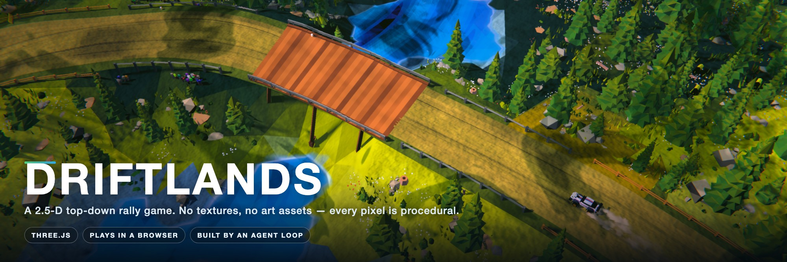
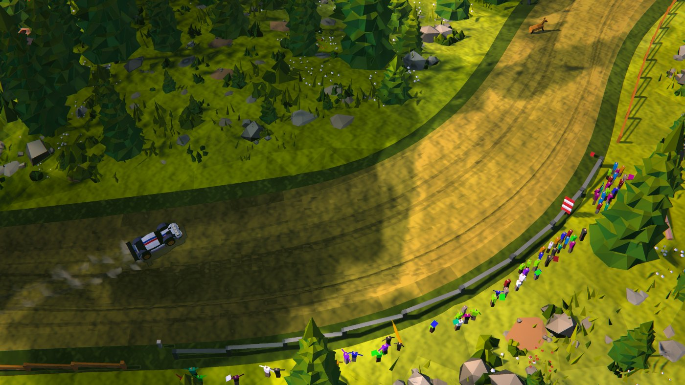
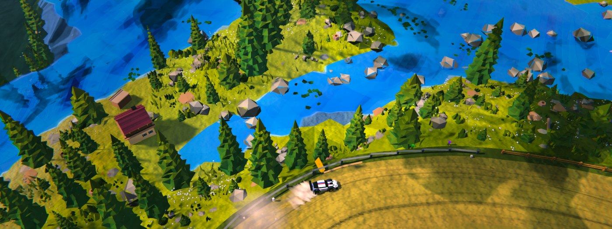
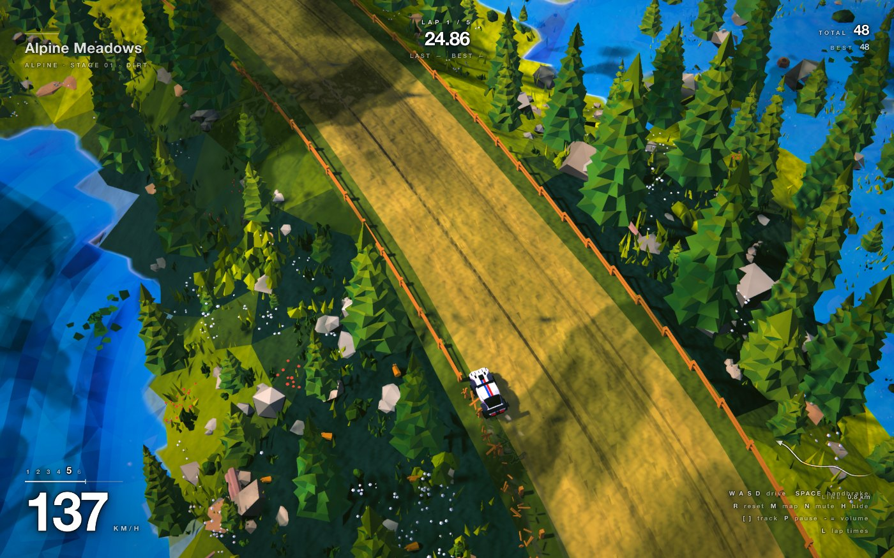

<p align="center">
  <b>A 2.5-D top-down rally game that runs in a browser.</b><br>
  Hand-brake turns on loose dirt, alpine lakes, timber bridges, and a crowd that only ever stands behind the steel.
</p>

<p align="center">
  <a href="https://deadover.github.io/DRIFTLANDS/"><b>▶ Play it now, in your browser</b></a><br>
  <sub>No install, no download. Arrow keys or WASD, and hold Space through the corners.</sub>
</p>

<p align="center">
  <a href="#run-it-yourself">Run it yourself</a> ·
  <a href="#controls">Controls</a> ·
  <a href="#bring-your-own-soundtrack">Music</a> ·
  <a href="#how-this-was-built">How this was built</a>
</p>

---

## There is not one image file in this game

No textures, no sprites, no models, no baked lighting. Every tree, rock, wheel rut, cloud shadow and spectator is generated from code at load time, and the whole world is coloured by a palette rather than by an artist's PNG. That was a hard constraint from the first commit, and it is the reason the thing looks the way it does.

<table>
  <tr>
    <td width="50%"></td>
    <td width="50%"></td>
  </tr>
  <tr>
    <td colspan="2"></td>
  </tr>
</table>

## What's in there

- **A 1700 × 1700 m alpine stage**, procedurally laid out — a real road network with spurs and junctions, not a loop drawn on a plane.
- **Drifting that rewards commitment.** A chain multiplier climbs to ×100 if you keep the car sideways, and drops the moment you straighten up or touch something.
- **Five timed laps**, per-lap splits and drift score, and a results table you can pull up mid-race (`L`).
- **Timber bridges with steel parapets**, breakable post-and-rail fences, guardrails on the corners that need them, and a jump over a river branch with slow-motion and fireworks on take-off.
- **A crowd of 561 spectators** who stand *only* behind metal guardrails — never behind a timber fence, never on a bridge parapet with a river under it, never on the road.
- **Deer, birds and hares** that notice you coming.
- **180 km/h** flat out, in sixth.

## Run it yourself

The [playable build](https://deadover.github.io/DRIFTLANDS/) is deployed from `main` on every push. To run it locally you need [Node.js](https://nodejs.org) 20+.

```bash
git clone https://github.com/DEADover/DRIFTLANDS.git
cd DRIFTLANDS
npm install
npm run dev
```

Then open the URL it prints. Click, and drive.

To build a copy you can hand to someone else:

```bash
node tools/package.mjs
```

That produces three things in `release/`:

| | what it is | use it when |
|---|---|---|
| `DRIFTLANDS/` | the whole game inlined into one `index.html` | you want someone to **double-click and play**, no server |
| `DRIFTLANDS-hosted/` | an ordinary `index.html` + `assets/` build | you're putting it on a web host |
| `DRIFTLANDS-web.zip` | the same, zipped with `index.html` at the root | uploading to itch.io, Netlify Drop, Cloudflare Pages |

## Controls

| | |
|---|---|
| `W A S D` / arrows | drive |
| `Space` | handbrake — this is the one that matters |
| `R` | put the car back on the road |
| `L` | lap times and drift score (pauses) |
| `H` | hide the HUD |
| `M` | racing line |
| `[` `]` | previous / next music track |
| `P` · `N` · `-` `=` | pause music · mute · volume |

## Bring your own soundtrack

Drop `.mp3` files into `music/` before you build, and they're compiled in.

A **built** copy can't read a folder next to it — browsers have no way to list a directory — so a packaged game opens two doors instead: **drag a folder straight onto the window**, or use the **"Add a music folder"** button on the title screen. Either way it starts when the race does, and `[` `]` switch tracks while you drive.

Nothing you add is ever bundled into a release. `music/` is git-ignored and the packager builds with the playlist stripped out, so handing someone the game never hands them your record collection.

## How this was built

This game was written by an AI agent running the **[Gauntlet Loop](https://somethingbig.ai/gauntlet-loop)** — a prompting method by [Matt Shumer](https://somethingbig.ai).

The shape of it: you give a **lead agent** a goal and a real example of what great looks like. The lead breaks the goal into the smallest pieces that can be improved separately, and each piece goes to a **builder** — while a separate **critic**, with no memory of having written the thing, compares the result against the bar and says what's wrong with it. Builders never grade their own work. The critic's complaints become the next round's work, and it repeats.

What made it work here was that the critics were not allowed to have opinions about the code. They had to look at the **real running output** — screenshots from a headless browser, and numbers pulled out of the live game — so "the car sinks into the road" became *max penetration 2.144 m, 44.8% of frames over 10 cm*, and the fix became *0.016 m, 0.0%*. Roughly a third of this repository is the measuring equipment: 38 harnesses under `tools/` that boot the game, drive it, and audit the result.

**27 rounds, 144 commits.** The commit log is worth reading if you're curious how it went — the messages record what was measured, what was wrong, and a fair number of the agent's own mistakes:

> *The jerky camera was never the camera: the frame loop had no clock of its own*
>
> *Tiling the scatter readmitted 42 species to the shadow map; count the scatter, not the mesh*
>
> *The packager shipped whatever was lying in dist/, and it was a day old*

## Under the hood

**Three.js** + **Vite**, plain ES modules, no TypeScript, no build-time asset pipeline. ~39k lines across 41 source files.

A few things that were harder than they look:

- **The simulation is deterministic.** No `Math.random`, no wall clock anywhere in the physics or the scoring — a seeded RNG and a fixed 1/120 s step. Two runs of the same input produce the identical world and the identical lap time, which is the only reason the screenshot harnesses can compare anything.
- **The frame loop is paced.** Rendering as fast as possible on a 120 Hz display meant frames occupied one, two or three refresh intervals at random, and the world was advanced by however long the last one took — so its apparent speed changed frame to frame by up to 3×. It reads as a jerky camera, and no amount of camera smoothing fixes it. A governor now renders on a whole number of refresh intervals, hands the simulation the nominal period, and trades resolution before frame rate to stay on the grid.
- **The ground you see is the ground you drive on.** Height queries read back the *drawn* mesh rather than the analytic field that generated it, because those two disagree by enough to drop a wheel through the road.
- **Collisions have materials.** A steel guardrail deflects you, a tree stops you and folds a corner, and a timber fence breaks — including on a glancing hit.

## Layout

```
src/
  world/      terrain, roads, bridges, water, props, the jump
  entities/   the car, the animals, the crowd
  core/       physics step, collisions, race + laps, the frame governor
  render/     camera, lighting, the post-processing chain
  fx/         particles, skid marks, screen feel
  audio/      synthesised engine + your music
tools/        38 harnesses: screenshot, audit, measure, package
```

## Credits

Built with the [Gauntlet Loop](https://somethingbig.ai/gauntlet-loop) method by [Matt Shumer](https://somethingbig.ai).

Visually indebted to **[art of rally](https://www.artofrally.com/)** by Funselektor — the game that made the case that a rally stage seen from above can be beautiful.
